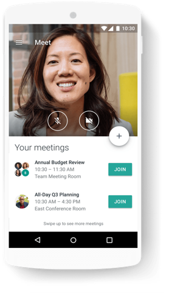
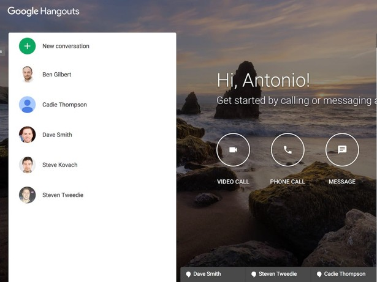
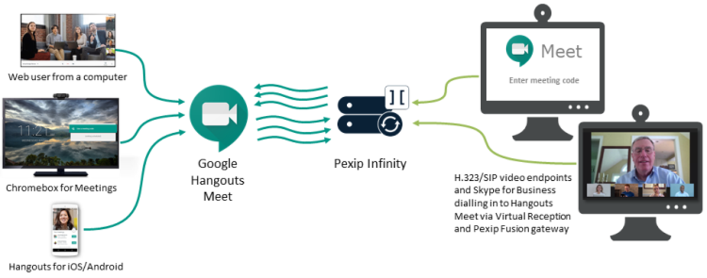

# How to Work Remotely: Using Google Meet

# by David D. Sykes

 

Photo From: https://gsuite.google.com/products/meet/

## Audience and Scope: 

The purpose of this document is to provide the audience with a general understanding how Google Meet works and the physical concepts that were used to create this software Google Meet. This document will focus on how to use Google Meet and the general dynamic of Google Meet rather than a specific product (such as Zoom). There are a ton of video conference software available on the Internet. To	 name a few, there is Zoom, GoToMeeting, Skype and Google Meet. Google Meet is the most commonly used software for people to have conferences on the Internet. Google Meet is a communication software product developed by Google. Google Meet was originally a feature of Google+ that would later become a standalone product in 2013. Google would also begin to integrate features from Google+ Messenger and Google Talk into Google Meet. In 2017, Google began to develop Google Meet into a product aimed at enterprise communication. After reading this document the audience will have a history of Google Meet, and understand how to work Google Meet.

The intended audience for this document is upperclassman in high school and college students who are interested in the Science, Technology, Engineering  and Math (STEM) fields. This document will make clear connections between the concepts that are learned in STEM related courses and how you can use these concepts to create software products. The understanding of creating software products like Google Meet will give the audience a better idea of the things that they can do in careers in the STEM fields.
An Introduction to Google Meet:
Google Meet is a communication software product developed by Google. Google Meet is written in the software language called Java. Google Meet became a standalone product in 2013. Google would then start developing Google Meet to become an enterprise communication tool. Google Meet is now part of the Google Suite line of products which consist of Google Meet and Google Hangout Chat. 

 
Figure 1: Image of Google Meet

The steps for starting a video meeting are to start a meeting from a web browser, mobile phone or a Google calendar event that includes a video meeting link. The exact steps are to: In a web browser, enter https://meet.google.com followed by 
1.	Click Join or start meeting.
2.	Enter  a nickname or leave it blank to start your own meeting.
3.	Click Join now.	

## Fundamentals of a Google Meet:
In order to understand how a video conference works, we need to discuss a few of the basic concepts of video conferencing.  Video conferencing means to conduct a conference between two or more participants at different sites by using computer networks to transmit audio and video data. For example, a point-to-point (two-person) video conferencing system works much like a video telephone. Each participant has a video camera, microphone and speakers mounted on the computer. As the two participants speak to one another, their voices are carried over the network and delivered  to the other’s speaker. In addition, whatever image appear in front of the video camera in a window on the other participant’s monitor.

 
 
Figure 2: Diagram of How Google Meet works.

Google Meet Composition:

_Google Meet_ is a standard-based video conferencing application using proprietary protocols for video, audio and data transcoding. Google has partnered with Pexip to provide interoperability between the Google protocol and standard-based SIP/H.323 protocol to enable communication between Google Meet. Google Meet comes with additional features designed for business use which include:

•	Participants can share their screens
•	The screen automatically focuses on the person who is speaking, and “intelligent muting” prevents background noise.
•	Businesses can host Hangouts on Air and public livestreams that are automatically saved to business’s YouTube account
•	Integration with Google Calendar for one-click start of a Google Meet conversation at the beginning of a meeting
•	Custom controls for admins, including limiting access, turning chat history off, and the ability to eject participants for privacy
•	Custom status messages.

## Conclusion:

With advancements in technology working from home has become a possibility for many workers. Google Meet and other conference technologies allow for people to work from home and have tele-health meetings with doctors, and technical interviews for software engineering roles. I personally love using Google Meet and I have had several interviews with software companies for internships. I will continue to use Google Meet as technology brings us closer together as humans.

## References:

Most of the knowledge in this paper has come from my experience using Google Meet which I have used for technical interviews with software companies.
Other references are below:

- https://gsuite.google.com/products/meet/
- https://meet.google.com/
- https://www.businessinsider.com/what-is-google-meet

